  &nbsp;
  &nbsp;
  &nbsp;
  

I build AI assistants, CRMs, and dev tooling that holds up in production. 
Currently shipping two indie products: <b>hostlist-io</b> (Next.js) and <b>wp-maintain-app</b> (React, TypeScript).

## Proof of work

Green squares are cheap. Merged diffs in repos people actually run are the ledger.

  
  

**[openclaw/openclaw #3304](https://github.com/openclaw/openclaw/pull/3304)** · A subprocess helper in this 100k+ star macOS AI assistant piped stderr but never read it, so any child noisy enough to fill the pipe buffer deadlocked and hung forever. The fix redirects stderr to `FileHandle.nullDevice` so the buffer can never fill. Swift, +3 / -2, merged January 2026.

**[zeroclaw-labs/zeroclaw #5790](https://github.com/zeroclaw-labs/zeroclaw/pull/5790)** · The Telegram channel silently auto-denied every tool approval request because no operator had a way to answer. I built the cross-crate approval flow and surfaced it as inline keyboard buttons, so approving or denying a tool call is one tap in chat. Rust, +444 / -7 across 6 crates, merged April 2026.

On the bench: [lovellylilly](https://github.com/abhijeet117/lovellylilly), a reasoning model experiment in JavaScript.

## How I work

## Stack

Plus Stripe for payments. The Rust ships in <a href="https://github.com/zeroclaw-labs/zeroclaw/pull/5790">zeroclaw #5790</a>, the Swift in <a href="https://github.com/openclaw/openclaw/pull/3304">openclaw #3304</a>.

## Stats

## Contribution snake

<picture>
  <source media="(prefers-color-scheme: dark)" srcset="https://raw.githubusercontent.com/abhijeet117/abhijeet117/output/github-contribution-grid-snake-dark.svg">
  <source media="(prefers-color-scheme: light)" srcset="https://raw.githubusercontent.com/abhijeet117/abhijeet117/output/github-contribution-grid-snake.svg">
  
</picture>

  

<i>Upgrading Myself,</i>*

<b>Abhijeet</b>

* The trailing comma is intentional. The sentence is not finished.

